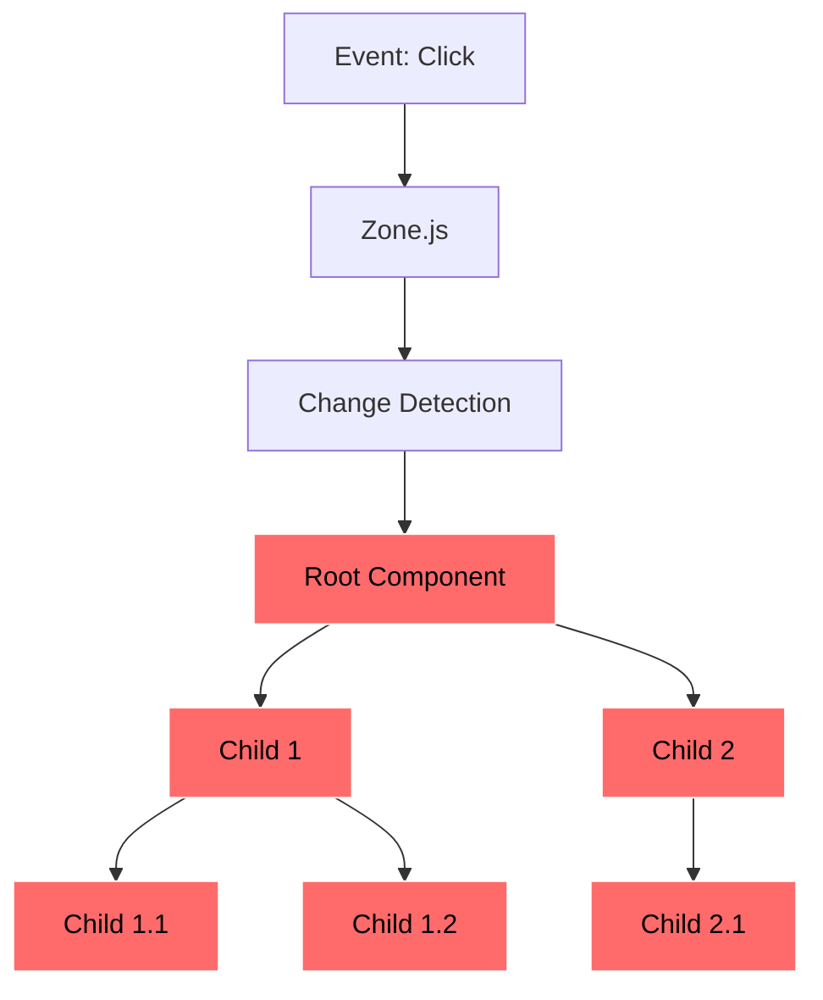

# Angular Zoneless

## Der Paradigmenwechsel zu Reactive Programming

### Von Implicit Change Detection zu Signals & Async Resources

<!--
Willkommen! Kurz vorstellen.
Heute geht es um einen der größten Paradigmenwechsel in Angular seit Jahren.
Viele haben das vielleicht noch gar nicht so richtig mitbekommen.
-->

---
layout: center
---

# Warum ist das relevant?

<v-clicks>

- 🔄 **Fundamentaler Richtungswechsel** in Angular (v16+)
- ⚡ **Performance-Revolution** durch gezieltes Update-System
- 🧠 **Neue Denkweise** erforderlich
- 📦 Möglicherweise **unbemerkt** an vielen vorbei gegangen

</v-clicks>

<!--
Das ist kein kleines Feature-Update - das ist ein fundamentaler Wechsel in der Art wie Angular funktioniert.
Angular 16 hat damit begonnen, aber viele Teams nutzen noch die alte Change Detection.
Es erfordert wirklich ein Umdenken - nicht nur neue APIs lernen.
-->

---

# Früher vs. Heute

<div class="grid grid-cols-2 gap-8">

<div>

## 🎩 Die alte Magie

```typescript
// Angular zaubert automatisch
@Component({...})
class OldComponent {
    counter = 0;

    increment() {
        this.counter++;
        // Angular merkt's automatisch! ✨
    }
}
```

**"Ich ändere etwas und Angular kümmert sich darum"**

</div>

<div v-click>

## 🎯 Die neue Explizitheit

```typescript
// Ich kommuniziere Änderungen
@Component({...})
class NewComponent {
    counter = signal(0);

    increment() {
        this.counter.update(v => v + 1);
        // Ich sage Angular explizit: Update!
    }
}
```

**"Ich kommuniziere Änderungen und Angular aktualisiert gezielt"**

</div>

</div>

<!--
Links: Die gewohnte Welt - ich ändere eine Variable, Angular merkt das magisch.
Rechts: Die neue Welt - ich sage Angular explizit: "Hey, hier hat sich was geändert!"
Das ist der Kernunterschied.
-->

---
layout: section
---

# Teil 1

## Die alte Welt: Zone.js & Implicit Change Detection

<!--
Schauen wir uns erst mal an, wie es bisher funktioniert hat.
-->

---

# Was ist Zone.js?

<v-clicks>

- 📝 **Monkey-Patches** alle async APIs (setTimeout, events, HTTP, ...)
- 👀 **Überwacht** automatisch alle Async-Operationen
- 🔔 **Benachrichtigt** Angular über potenzielle Änderungen
- 🔄 **Triggert** Change Detection für die gesamte Component-Tree

</v-clicks>

<v-click>

```typescript
// Zone.js wrapped event listener
button.addEventListener('click', () => {
    this.data = 'Neu';
    // Zone.js merkt: "Event handler fertig!"
    // → Führt Change Detection aus
});
```

</v-click>

<!--
Zone.js ist die "Magie" hinter Angular's automatischer Change Detection.
Es patcht alle Browser-APIs zur Laufzeit - addEventListener, setTimeout, Promises, etc.
Dadurch weiß Angular: "Aha, da ist was asynchrones passiert, ich sollte mal schauen ob sich was geändert hat."
Das funktioniert, ist aber nicht ohne Probleme...
-->

---

# Klassische Angular Component

```typescript {all|3-8|10-12|14-20|all}{maxHeight:'412px'}
@Component({
    selector: 'app-user-list',
    template: `
    <h2>Benutzer: {{ users.length }}</h2>
    <ul>
      @for (user of users; track user.id) {
        <li>{{ user.name }}</li>
      }
    </ul>
    <button (click)="loadUsers()">Laden</button>
  `
})
export class UserListComponent implements OnInit {
    users: User[] = [];

    ngOnInit() {
        this.loadUsers();
    }

    loadUsers() {
        this.http.get<User[]>('/api/users').subscribe(data => {
            this.users = data;
            // Zone.js triggert automatisch Change Detection! ✨
        });
    }
}
```

<!--
Ein typisches Angular Component wie wir es kennen.
Ich ändere users, und Angular aktualisiert automatisch das Template.
Das ist bequem, aber schauen wir mal was dabei passiert...
-->

---

# Was passiert unter der Haube?

<div class="grid grid-cols-2 gap-8 text-sm">

<div>

### Jeder Click/Request/Timeout

1. Zone.js fängt Event ab
2. Führt Callback aus
3. Markiert Component als "dirty"
4. **Prüft GESAMTEN Tree**
5. Vergleicht alte vs. neue Werte
6. Aktualisiert DOM

</div>

<div v-click>

### Das Problem



**Alle Components werden geprüft!**

</div>

</div>

<!--
WICHTIG: Das ist der Kern des Performance-Problems!

Zu Punkt 5 - "Vergleicht alte vs. neue Werte":
- Template-Bindings: Angular evaluiert ALLE Expressions neu ({{ user.name }}, [value]="counter")
- @Input() Properties: Nur REFERENZ-Vergleich!

Klassisches Problem: @Input() items: any[] = []
- items.push(newItem) → Gleiche Referenz → Change Detection erkennt es NICHT
- items = [...items, newItem] → Neue Referenz → Change Detection erkennt es

Das war immer eine häufige Fehlerquelle! Mit Signals ist das expliziter und klarer.

Beispiel aus der Praxis: App mit 500 Components, in einer Blatt-Component läuft ein Timer.
- Mit Zone.js: ALLE 500 Components werden bei jedem Timer-Tick geprüft!
- Mit Signals: NUR die eine Component mit dem Timer wird aktualisiert!

Das ist nicht 2x schneller - das ist 500x effizienter!
Bei großen Apps ist der Unterschied dramatisch spürbar.
-->

---
layout: section
---

# Der Paradigmenwechsel

## Warum ändert Angular die Strategie?

---

# Probleme der alten Lösung

<v-clicks>

## 🐌 Performance

- Change Detection läuft durch **gesamten** Component Tree
- Viele unnötige Checks bei großen Anwendungen
- Bundle-Size: Zone.js fügt ~15-20KB hinzu

## 🎭 "Magic" = Unvorhersehbar

- Schwer zu debuggen: "Warum wird das nicht aktualisiert?"
- Oder: "Warum wird das zu oft aktualisiert?"
- Referenz-Vergleich bei Inputs: `items.push()` wird nicht erkannt
- Keine Kontrolle über Update-Timing

</v-clicks>

<!--
Performance ist offensichtlich - aber die Unvorhersehbarkeit ist genauso wichtig.

Das Referenz-Problem ist ein Klassiker:
@Input() items - wenn Parent items.push(newItem) macht, erkennt Child das nicht.
Man muss items = [...items, newItem] machen. Das hat jeden schon mal getroffen!

Wer hat noch nie stundenlang debugged, warum sich das UI nicht aktualisiert?
Oder warum Change Detection 10x läuft obwohl sich nichts geändert hat?
Mit Zoneless haben wir endlich Kontrolle darüber.
-->

---

# Die Vision

<div class="grid grid-cols-2 gap-12">

<div>

## Implicit (alt)

> "Framework, mach du mal!"

- ❌ Keine Kontrolle
- ❌ Performance-Overhead
- ✅ Einfach für Anfänger
- ✅ Weniger Code

</div>

<div>

## Explicit (neu)

> "Ich sage dir genau, was sich ändert"

- ✅ Volle Kontrolle
- ✅ Optimale Performance
- ✅ Vorhersagbar
- ⚠️ Steile Lernkurve

</div>

</div>

<!--
Es ist ein Trade-off: Bequemlichkeit vs. Kontrolle und Performance.
Für kleine Apps war Zone.js völlig ok.
Aber Angular will mit React, Vue 3, Solid konkurrieren - da braucht es Performance.
-->

---
layout: section
---

# Teil 2

## Die neue Welt: Signals & Zoneless

<!--
Jetzt wird's spannend - wie funktioniert die neue Welt?
-->

---

# Signals: Die Grundbausteine

```typescript {all|2|4|6|8-10|all}
// Signal erstellen
const count = signal(0);

console.log(count());  // 0 - Lesen mit ()

count.set(5);          // Setzen

count.update(value => value + 1);  // Update basierend auf aktuellem Wert

console.log(count());  // 6
```

<v-clicks>

- 📦 **Wrapper** um einen reaktiven Wert
- 📖 Lesen mit `()`
- ✍️ Schreiben mit `.set()` oder `.update()`
- 🔔 Angular weiß **genau**, was sich geändert hat

</v-clicks>

<!--
Signals sind das Herzstück von Zoneless Angular.
Ein Signal ist ein Wrapper um einen Wert - Angular weiß exakt, wann sich dieser Wert ändert.
Lesen mit Klammern, schreiben mit set/update.
Gewöhnungsbedürftig, aber sehr mächtig.
-->

---

# Computed Signals

```typescript {all|2-3|5-9|11-12|all}
@Component({...})
class ShoppingCart {
    items = signal<Item[]>([]);

    // Wird automatisch neu berechnet wenn items sich ändert
    totalPrice = computed(() => {
        return this.items()
            .reduce((sum, item) => sum + item.price, 0);
    });

    addItem(item: Item) {
        this.items.update(current => [...current, item]);
        // totalPrice wird automatisch aktualisiert! 🎯
    }
}
```

<v-click>

**Computed Signals** = Abgeleitete Werte, die sich automatisch aktualisieren

</v-click>

<!--
Computed Signals sind abgeleitete Werte.
Wenn sich items ändert, wird totalPrice automatisch neu berechnet.
Das kennen manche vielleicht aus Vue oder MobX.
Sehr elegant für Dinge wie Summen, Filter, Sortierungen.
-->

---

# Effects: Seiteneffekte

```typescript {all|4-8|all}
@Component({...})
class UserProfile {
    userId = signal(123);

    constructor() {
        effect(() => {
            console.log('User changed:', this.userId());
            this.trackAnalytics(this.userId());
        });
    }

    changeUser(newId: number) {
        this.userId.set(newId);
        // Effect wird automatisch ausgeführt! 📡
    }
}
```

<v-click>

**Effects** = Code der läuft, wenn sich Signals ändern (ähnlich wie useEffect in React)

</v-click>

<!--
Effects sind für Seiteneffekte - Logging, Analytics, API-Calls.
Ähnlich wie useEffect in React, aber feingranularer.
Der Effect läuft automatisch, wenn sich userId ändert.
-->

---

# Async Resources (rxResource)
```typescript {all|3-7|9-12|14-17|all}{maxHeight:'412px'}
@Component({
    template: `
    @if (users.isLoading()) {
      <p>Lädt...</p>
    } @else if (users.hasError()) {
      <p>Fehler: {{ users.error() }}</p>
    } @else {
      <ul>
        @for (user of users.value(); track user.id) {
          <li>{{ user.name }}</li>
        }
      </ul>
    }
  `
})
class UserList {
    http = inject(HttpClient);

    users = rxResource({
        loader: () => this.http.get<User[]>('/api/users')
    });
}
```

<!--
rxResource ist perfekt für asynchrone Daten.
Es gibt auch httpResource als Shortcut.
Loading, Error und Success States sind eingebaut.
Sehr elegant - keine manuellen Subscribe/Unsubscribe mehr nötig.
-->

---

# Zoneless aktivieren

```typescript {all|5-8|all}
// main.ts
import { bootstrapApplication } from '@angular/platform-browser';
import { provideZonelessChangeDetection } from '@angular/core';

bootstrapApplication(AppComponent, {
    providers: [
        provideZonelessChangeDetection()
    ]
});
```

<v-clicks>

- 🎯 Seit Angular 18 experimentell verfügbar
- ✅ **Stable seit Angular 19** (November 2024)
- 📦 Zone.js wird nicht mehr geladen
- ⚡ Nur Signals, Async Pipe & explizite `markForCheck()` triggern Updates

</v-clicks>

<!--
So aktiviert man Zoneless - eine Zeile!
Seit Angular 19 ist es stable, seit Angular 21 sogar der Default.
Wichtig: Ohne Zone.js müssen alle Changes über Signals oder die Async Pipe kommen.
-->

---
layout: section
---

# Vergleich

## Vorteile & Nachteile beider Ansätze

---

# Zone.js Approach

<div class="grid grid-cols-2 gap-12">

<div>

## ✅ Vorteile

- Einfach für Einsteiger
- Weniger Boilerplate
- "Es funktioniert einfach"
- Bewährte Lösung (seit Angular 2)

</div>

<div>

## ❌ Nachteile

- Performance-Overhead
- Unvorhersagbares Verhalten
- Schwer zu debuggen
- Größere Bundle-Size
- Prüft gesamten Tree

</div>

</div>

<!--
Zone.js bleibt eine valide Option für kleinere Apps oder Teams, die die Einfachheit schätzen.
Aber die Nachteile wiegen schwer bei größeren Anwendungen.
-->

---

# Signals & Zoneless

<div class="grid grid-cols-2 gap-12">

<div>

## ✅ Vorteile

- 🚀 Deutlich bessere Performance
- 🎯 Präzise Updates (fine-grained)
- 📉 Kleinere Bundle-Size
- 🔮 Vorhersagbar & debuggbar
- 🌍 Aligned mit modernen Standards

</div>

<div>

## ❌ Nachteile

- Steile Lernkurve
- Mehr Code zu schreiben
- Migration bestehender Apps aufwändig
- Breaking Change für viele Patterns

</div>

</div>

<!--
Die Performance-Verbesserungen sind dramatisch - besonders bei großen Apps.
Die Lernkurve ist real - das Team braucht Zeit um umzudenken.
Aber: Es lohnt sich!
-->

---

# Migration Considerations

<v-clicks>

## Wann macht der Wechsel Sinn?

✅ **Neue Projekte**: Auf jeden Fall Signals nutzen!

✅ **Performance-kritische Apps**: Große Anwendungen profitieren enorm

⚠️ **Bestehende Apps**: Schrittweise Migration möglich
- Beide Ansätze können koexistieren
- Neue Components mit Signals schreiben
- Alte Components nach und nach migrieren

❌ **Kleine, einfache Apps**: Migration-Aufwand eventuell nicht gerechtfertigt

</v-clicks>

<!--
Neue Projekte: No-brainer, nutzt Signals!
Bestehende Apps: Nicht alles auf einmal umschreiben müssen.
Inkrementelle Migration ist möglich und sinnvoll.
-->

---

# Migration Path

```typescript
// Phase 1: Beide Ansätze parallel
@Component({...})
class MixedComponent {
    // Alt: normale Properties
    oldCounter = 0;

    // Neu: Signals
    newCounter = signal(0);

    // Funktioniert beides!
}
```

<v-click>

```typescript
// Phase 2: Vollständig auf Signals
@Component({...})
class FullyModernComponent {
    counter = signal(0);
    users = signal<User[]>([]);
    filteredUsers = computed(() =>
        this.users().filter(u => u.active)
    );
}
```

</v-click>

<v-click>

💡 **Tipp:** Apps mit `OnPush` Change Detection Strategy migrieren leichter zu Zoneless - das kann ein guter Zwischenschritt sein!

</v-click>

<!--
Wichtig für die Migration: Ihr müsst nicht alles auf einmal umstellen.
OnPush als Zwischenschritt ist clever - dann habt ihr schon bewusste Change Detection.
Von OnPush zu Zoneless ist dann ein kleinerer Schritt.
-->

---
layout: section
---

# Ausblick & Fazit

---

# Angular's Roadmap

<v-clicks>

- ✅ **Angular 19** (November 2024): Signals & Zoneless sind **stable**
- ✅ **Angular 20** (Mai 2025): Weitere Optimierungen und Performance-Verbesserungen
- 🎉 **Angular 21** (November 2025, gerade erschienen!):
    - **Signal Forms** als neuer Standard
    - **Zoneless ist jetzt der Default**
    - Zone.js nur noch opt-in für Legacy-Apps
- 🔄 Immer mehr APIs werden Signal-basiert (Router, HttpClient, etc.)
- 🌟 Angular ist vollständig auf **Fine-grained Reactivity** umgestellt

**Signals sind nicht mehr die Zukunft - sie sind die Gegenwart!**

</v-clicks>

<!--
Das Team bewegt sich schnell!
Angular 21 macht Zoneless zum Default - das ist ein klares Statement.
Signal Forms, Signal Router - alles wird reaktiv.
Angular holt auf zu React, Vue & Co.
-->

---

# Empfehlungen für Teams

<v-clicks>

## 🚀 Neue Projekte
Nutzt Signals von Anfang an. Es lohnt sich!

## 🔄 Bestehende Projekte
- Evaluiert den Performance-Impact
- Plant schrittweise Migration
- Schult das Team in Signals

## 📚 Learning
- Offizielle Angular Docs
- Experimentiert mit Signals

</v-clicks>

<!--
Meine konkreten Empfehlungen:
Neue Projekte: Kein Grund mehr für Zone.js.
Bestehende: Messt zuerst, dann migriert gezielt.
Wichtig: Team-Schulung nicht vergessen - das ist ein Mindset-Shift!
-->

---
layout: center
class: text-center
---

# Fazit

<v-clicks>

## Angular vollzieht einen mutigen Paradigmenwechsel

Von **"Magic"** zu **"Explizit"**

Von **"Implicit"** zu **"Reactive"**

Von **"Overhead"** zu **"Performance"**

<div class="text-4xl mt-8">
🎯 → ⚡ → 🚀
</div>

</v-clicks>

<!--
Zusammenfassung:
Es ist ein mutiger Schritt vom Angular Team.
Mehr Kontrolle, bessere Performance, moderneres Framework.
Der Trend geht klar Richtung Fine-grained Reactivity.
Angular ist wieder konkurrenzfähig!
-->

---
layout: end
class: text-center
---

# Danke!

## Fragen?

<div class="pt-12 text-sm opacity-50">
Folien: QR-Code:
</div>

<!--
Zeit für Fragen!
Erfahrungen mit Signals?
Pläne zur Migration?
-->
